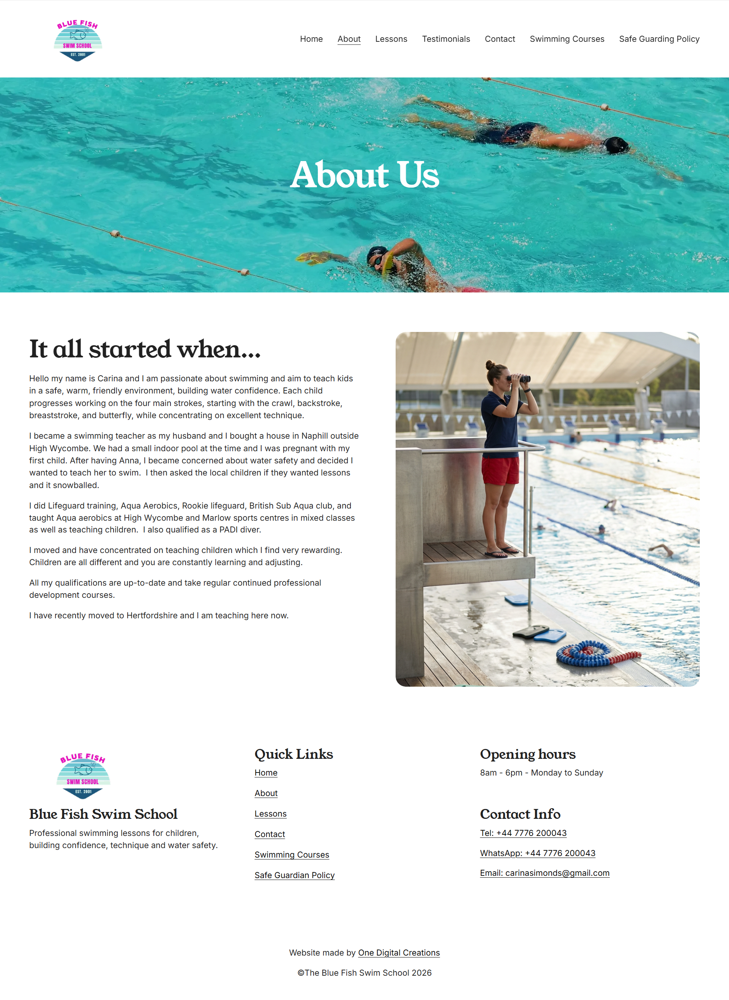
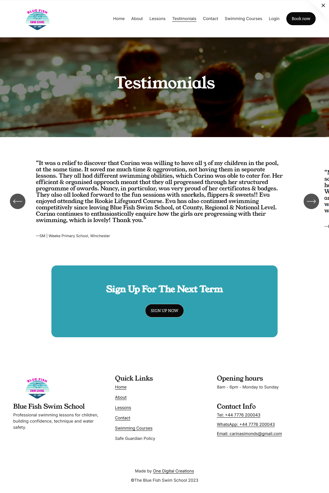

# 🏊 Blue Fish Swim School – Professional Squarespace Website Development

This Squarespace website was designed and developed for **Blue Fish Swim School** to establish a modern, engaging, and user-friendly online presence. The website features a clean and responsive design that allows parents and students to easily explore swim programs, courses, testimonials, and contact information across all devices. With intuitive navigation, professionally structured content, and visually appealing layouts, the site effectively represents the brand while encouraging inquiries and course registrations.

**Live Website:** *Add Website URL Here*

---

## 📌 Project Overview

* Fully responsive design optimized for desktop, tablet, and mobile devices
* Modern and clean user interface with intuitive navigation
* SEO-friendly page structure for improved search engine visibility
* Fast-loading pages with optimized images and performance enhancements
* Professionally organized content highlighting swimming lessons and programs
* User-focused layouts designed to increase engagement and inquiries

### Website Pages

* 🏠 Home
* ℹ️ About
* 🏊 Lessons
* ⭐ Testimonials
* 📚 Courses
* 📞 Contact
* 📄 Additional Information Page
* 📄 Additional Information Page

---

## 🛠 Tools & Technologies Used

* **Squarespace**
* **Squarespace Fluid Engine**
* **Custom CSS**
* **HTML**
* **JavaScript**
* **Responsive Design**
* **SEO Optimization**
* **SSL Integration**

---

## 🎨 Design Process & Efforts

* **Theme Customization** – Customized the Squarespace template to align with the swim school's branding, creating a clean, welcoming, and professional appearance while maintaining consistency throughout the website.

* **UI/UX Design** – Designed an intuitive user experience with well-structured layouts, clear typography, balanced spacing, and easy navigation to help visitors quickly find information about lessons and courses.

* **Page Development** – Developed all eight website pages using Squarespace's Fluid Engine, ensuring responsive layouts, organized content sections, and seamless navigation throughout the site.

* **Content Organization** – Structured course information, testimonials, lesson details, and contact information into easily accessible sections that improve readability and user engagement.

* **Image Optimization** – Optimized website images to reduce loading times while maintaining excellent visual quality across all devices.

* **SEO & Performance Optimization** – Applied Squarespace SEO best practices including optimized page titles, meta descriptions, image alt text, and performance enhancements to improve search engine rankings and overall site visibility.

* **Testing & Responsiveness** – Thoroughly tested the website across multiple screen sizes and browsers to ensure consistent performance, responsive layouts, and a smooth browsing experience.

---

## 🖼 Project Gallery

---

## 🚀 Deployment & Maintenance

* Deployed on secure **Squarespace Hosting**
* SSL encryption enabled for secure browsing
* Optimized for speed, accessibility, and responsive performance
* Regular content updates and maintenance to ensure reliability
* Built using Squarespace's reliable cloud infrastructure for high availability

---

## 📖 Learnings & Takeaways

* Developed a fully responsive client website using Squarespace
* Improved expertise in Squarespace Fluid Engine and custom styling
* Implemented SEO best practices to enhance online visibility
* Built structured content layouts focused on user experience and accessibility
* Optimized website performance through efficient media management and responsive design techniques

---

## 👩‍💻 Developer

**Developed by:** [Syeda Aneesa](https://github.com/Syedaaneesa)

**Role:** Squarespace Developer / Designer

**Project Type:** Client-based live website project

---

### ⭐ If you like this project, consider giving it a star!

https://github.com/Syedaaneesa/Blue-Fish-Swim-School
